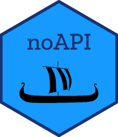

<!-- README.md is generated from README.Rmd. Please edit that file -->

```{r, include = FALSE}
knitr::opts_chunk$set(
  collapse = TRUE,
  comment = "#>",
  fig.path = "man/figures/README-",
  out.width = "100%"
)
```

# noAPI <a href="https://riksrevisjonen.github.io/noAPI/"></a>

<!-- badges: start -->
[](https://github.com/Riksrevisjonen/noAPI/actions/workflows/R-CMD-check.yaml)
<!-- badges: end -->

The goal of noAPI is to make it easier for users to retrieve data from public Norwegian APIs. 

## Installation

You can install the development version of noAPI from [GitHub](https://github.com/) with:

```r
# install.packages("devtools")
devtools::install_github("Riksrevisjonen/noAPI")
```

## Examples 

```{r, eval=FALSE}
library(noAPI)

# Get latest exchange rate from 'Norges Bank'
get_exchange_rate('USD') 

# Get entity information from 'Enhetsregisteret'
get_entity(974760843)

# Get address information from 'Kartverket'
get_address_info('munkegata 1 trondheim')

```

For a full list of available functions please refer to the [package documentation](https://riksrevisjonen.github.io/noAPI/reference/index.html).

## Getting help

If you encounter a bug or want to submit a feature request please file an issue on [GitHub](https://github.com/Riksrevisjonen/noAPI/issues). We kindly ask you to include a minimal reproducible example when possible. For other questions please reach out to the package authors.

## Acknowledgments

The ship used in noAPIs logo is based on a 3D model of the Norwegian Oseberg Viking Ship originally created by Dane Ericksen. The conversion to a 2D black-and-white model was done by the package authors. Ericksen's work is licensed under [CC BY 4.0](https://creativecommons.org/licenses/by/4.0/).
